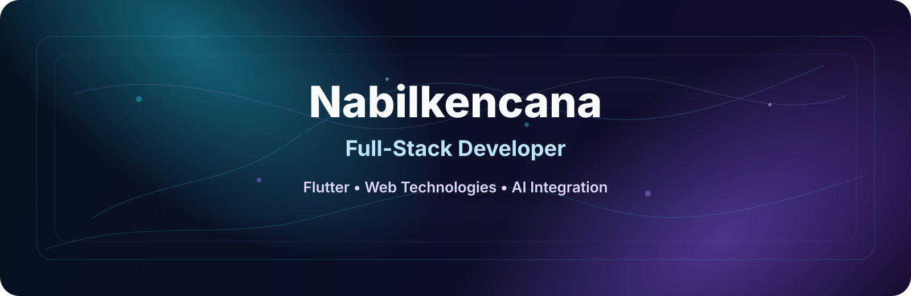

  <picture>
    <source media="(max-width: 760px) and (prefers-color-scheme: dark)" srcset="./assets/hero/agent-console-v5-mobile-dark.svg">
    <source media="(max-width: 760px)" srcset="./assets/hero/agent-console-v5-mobile-light.svg">
    <source media="(prefers-color-scheme: dark)" srcset="./assets/hero/agent-console-v5-dark.svg">
    <source media="(prefers-color-scheme: light)" srcset="./assets/hero/agent-console-v5-light.svg">
    
  </picture>

  

## About Me

I am **Nabilkencana**, a full-stack developer specializing in **Flutter, modern web technologies, and AI integration**.

Currently studying Computer Science, I focus on building scalable applications with clean architecture and best practices. I love exploring the intersection of mobile ecosystems, web backends, and AI technologies to build products that solve real-world problems.

## Current Focus

| Area | What I am exploring |
| --- | --- |
| **Mobile Development** | Building robust, high-performance cross-platform applications using Flutter & Dart. |
| **Web & Backend** | Designing reliable APIs, middleware, and services using TypeScript, Node.js, NestJS, and Prisma. |
| **AI Integration** | Implementing intelligent features, LLM workflows, and smart automation into applications. |

## Featured Work

<!-- AUTO:FEATURED:START -->
| Project | Focus | Why it matters |
| --- | --- | --- |
| [**MOVITE Frontend**](https://github.com/nabilkencana/dev-frontend-undangan) | Invitation website | Website for create digital invitation easily and quickly. Built with React Js. |
| [**Oksigen Medis 24 Jam (Mobile)**](https://github.com/nabilkencana/oksigen24medis-mobile) | Medical oxygen supply platform | Mobile application for ordering and delivering medical oxygen, including emergency features and order tracking. Built with Flutter. 🕒 Updated Jul 28, 2026 |
| [**Portofolio NabilKencana**](https://github.com/nabilkencana/Portofolio) | Portfolio website NabilKencana | Portfolio website NabilKencana to show my project and my skill. Built with Vite Js. 🕒 Updated Jul 26, 2026 |
<!-- AUTO:FEATURED:END -->

## Tech Stack

  
  
  
  
  
  
  
  
  
  
  
  
  
  
  

## Recent Activity

<!-- AUTO:ACTIVITY:START -->
- Jul 28, 2026: pushed 1 commit to [nabilkencana/Oksigen24Medis-Mobile](https://github.com/nabilkencana/Oksigen24Medis-Mobile).
- Jul 27, 2026: pushed 1 commit to [nabilkencana/SuaraMoklet-Frontend](https://github.com/nabilkencana/SuaraMoklet-Frontend).
- Jul 26, 2026: pushed 1 commit to [nabilkencana/Portofolio](https://github.com/nabilkencana/Portofolio).
- Jul 26, 2026: pushed 1 commit to [nabilkencana/nabilkencana](https://github.com/nabilkencana/nabilkencana).
- Jul 24, 2026: pushed 1 commit to [nabilkencana/Portofolio](https://github.com/nabilkencana/Portofolio).
- Jul 24, 2026: pushed 1 commit to [nabilkencana/Oksigen24Medis-Dashboard](https://github.com/nabilkencana/Oksigen24Medis-Dashboard).
<!-- AUTO:ACTIVITY:END -->

---

  Building high-quality applications at the intersection of mobile, web, and intelligence.

